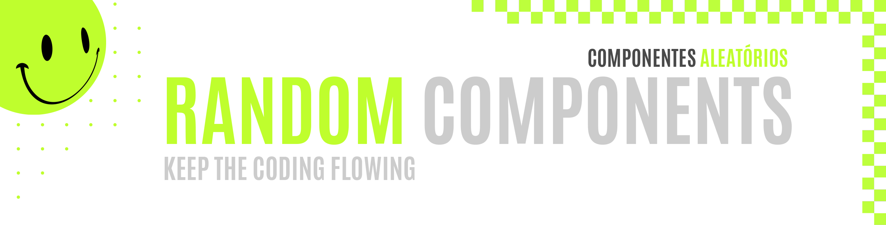

 
 

 

Welcome to the first Random Components repository! This is a place where I keep my codes built for some components found around the internet. Most of the time all I had was plain images, so it was a fun challenge itself to replicate this stuff only by eye. This repository is intended to keep practicing the basics while I specialize in more advanced topics. 

##### Bem-vindo(a) ao primeiro repositório Random Components. Este se trata de um repositório onde eu armazeno todos os códigos que construí para componentes aleatórios encontrados pela internet. Na maior parte do tempo, tudo o que eu tinha eram imagens, então foi um desafio em si conseguir replicar tudo apenas no olhômetro. Este repositório foi criado com a intenção de sempre praticar a base, enquanto me especializo em tópicos mais avançados.

 
 
 

 

As I study, all the Random Components repositories also will be growing and getting more specialized, using a mix of other technologies. Don't forget to check the incoming repositories to see other examples. For this repository, I will be using:

##### Enquanto estudo, todos os repositórios da série Random Components também irão crescendo e se tornando mais especializados, utilizando uma variedade maior de tecnologias. Não deixe de acompanhar os próximos repositórios para conhecer outros exemplos. Para o presente repositório, estou usando:

 
 

  
  

 
 

 

|                                                          |
| :------------------------------------------------------: |
|  |
|             **Component #01:** Scan Me Stamp Set             |
| **Original Project:** [🌐](https://github.com/malunaridev/Random-Components-01/blob/master/assets/Example-01.jpg) / **My Code:** [📄](https://github.com/malunaridev/Random-Components-01/tree/master/01-scan-me-stamp-set) / **Live Preview:** [🌐](https://rc-1-scan-me-stamp-set.vercel.app/)

 
 
 

 

| Validator                                                                        |                     Test & Pass                     |
| -------------------------------------------------------------------------------- | :--------------------------------------------: |
| [Markup Validation Service](https://validator.w3.org/) - <em>w3.org</em>         |  |
| [CSS Validation Service](https://jigsaw.w3.org/css-validator/) - <em>w3.org</em> |  |

 
 
 

