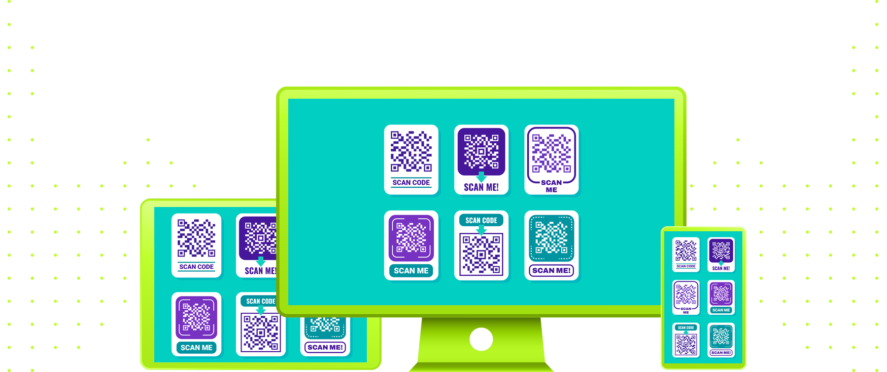

 
 

|                                                          |
| :------------------------------------------------------: |
|  |
|             **Component #01:** Scan Me Stamp Set             |
| **Original Project:** [🌐](https://github.com/malunaridev/Little-Random-Things-01-to-10/blob/master/scan-me-stamp-set/assets/Example.jpg) / **My Code:** [📄](https://github.com/malunaridev/Little-Random-Things-01-to-10/tree/master/scan-me-stamp-set) / **Live Preview:** [🌐](https://lrt-1-scan-me-stamp-set.vercel.app/)

 
 

 

Welcome to Litte Random Things! This is a special repository where I code everything I found cool around the internet. Sometimes it were just some images, tables, components, etc... I'm starting this repository because I want to improve my replicate skill: when I see a image, I want to know that I able to transform that into code. It could be useful, it could not, but I'm 100% sure that this could improve my coding skills by the time.

##### Bem-vindos(as) a Little Random Things! Esse é um repositório especial onde eu codo tudo que eu encontrei de legal ao navegar pela internet. Às vezes, eram apenas imagens, tabelas, componentes, etc... Estou iniciando esse repositório poque eu quero melhorar a minha capacidade de replicação: quando eu vejo uma imagem, quero me certificar de que eu consigo transformar aquilo em código. Poderá ser útil, ou não, mas eu tenho 100% de certeza de que isso pode melhorar as minhas habilidades em código ao longo do tempo.

 
 
 

 

- HTML
- CSS

 
 
 

 

| Validator                                                                        |                     Passed                     |
| -------------------------------------------------------------------------------- | :--------------------------------------------: |
| [Markup Validation Service](https://validator.w3.org/) - <em>w3.org</em>         |  |
| [CSS Validation Service](https://jigsaw.w3.org/css-validator/) - <em>w3.org</em> |  |

 
 
 

 

This first project taught me a lot about positioning elements. Today, I see that my code is not really perfect, but I did what I could the knowledge I had in that day, and I'm pretty proud of myself at this point. The use of positioning really made a difference in how I understood the whole box-model concept.

##### Esse primeiro projeto me ensinou muito sobre posicionamento de elementos. Hoje, eu vejo que meu código estava longe da perfeição, mas eu fiz o que pude com o conhecimento que eu tinha naquele tempo, e eu estou orgulhosa de mim mesma pelo ponto em que cheguei. O uso do posicionamento realmente fez a diferença em sobre como eu entendia todo o conceito de box-model.

 
 
 

